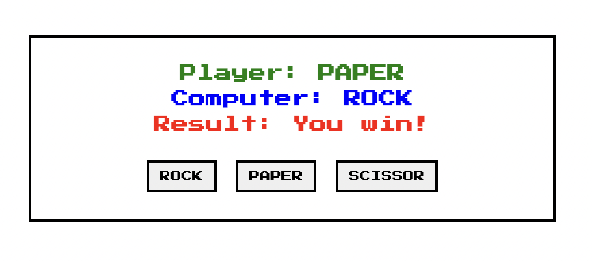

# Rock Paper Scissors Game

Live Demo: https://mia-rock-paper-scissor-game.netlify.app/

## 功能
玩家选择 ROCK, PAPER 或 SCISSOR，电脑随机生成 ROCK, PAPER 或 SCISSOR，将用户的选择和电脑的选择比较，得出赢家。

## 代码逻辑
1. 玩家点击选择按钮，将选中的按钮文本显示在`Player: `上。
2. 用`Math.random`生成1-3的随机数，再将电脑随机生成的选择显示在`Computer: `上，其中：
    - 1 = "ROCK"
    - 2 = "PAPER"
    - 3 = "SISSOR"
3. 先比较两者的选择是否相同，相同得出"平局"的结果。
4. 不同则继续比较：
    - 当电脑的选择是ROCK时，玩家的选择是否是PAPER，如果是，玩家赢，如果不是，玩家输。
    - 当电脑的选择是PAPER时，玩家的选择是否是SISSOR，如果是，玩家赢，如果不是，玩家输。
    - 当电脑的选择是SISSOR时，玩家的选择是否是ROCK，如果是，玩家赢，如果不是，玩家输。

## 其他
用这个相似的逻辑可以写出生活大爆炸中Sheldon的[Rock Paper Scissors Lizard Spock](https://www.youtube.com/watch?v=x5Q6-wMx-K8)。